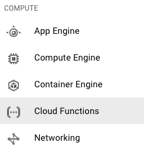

### Containerize and flatten your payment processing server into microservices using GCF.

`GCF-Stripe`is a serverless implementation of basic Stripe requests using Google Cloud Functions as containerized microservices

Check out the folders in the `master` branch where you'll find different requests ready to be dropped into your [Google Cloud Functions](https://cloud.google.com/functions/).

<h3>Getting Started</h3>
1.) Visit the [GCF](https://cloud.google.com/functions/) welcome page, and click "Sign Up for Alpha". You need your account whitelisted by Google in order to use Cloud Functions in beta. See [this thread](https://github.com/apex/apex/issues/232) for more details if you have trouble getting access.

2.) Once whitelisted and logged in to your Cloud Platform Console, select the hamburger menu on the left, and enter the "Cloud Functions" management section. 

3.) From here, you will create a new cloud function, ensuring to select `HTTP Trigger` as the Trigger option. 

4.) Select `Inline Editor` under the Source code option, or upload your your own versiobn, using the code supplied in this repo. 

Happy serverless computing!

